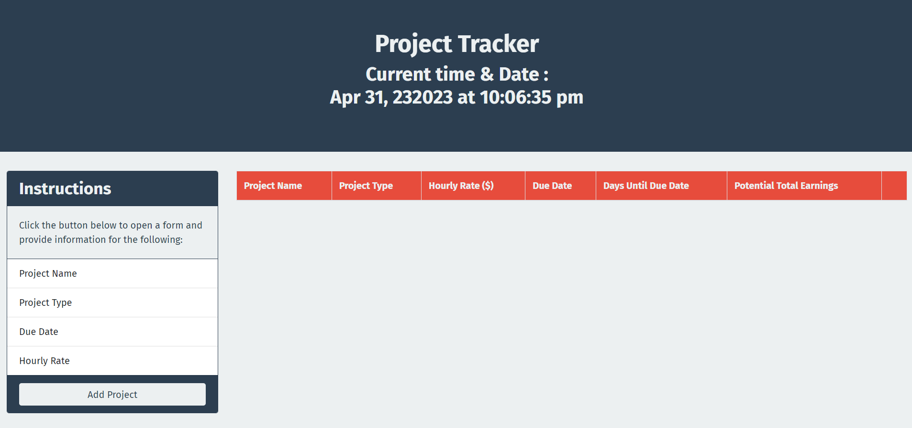
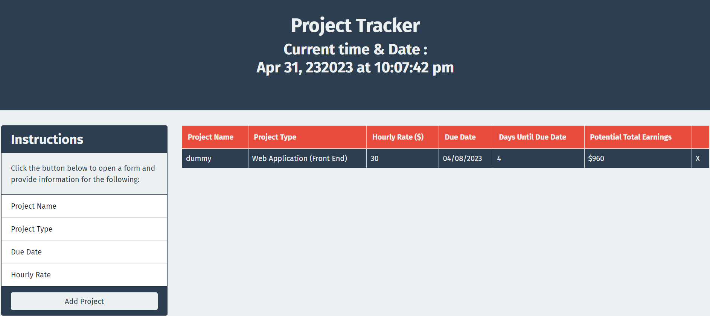

# Project-Tracker-Bootstrap-JQuery-and-JQueryUI

a project tracker application using Bootstrap, jQuery, jQueryUI, Moment, and Google Fonts.

# Project Tracker

web application to track different projects

This is a project tracker application which allows to add the name of project, type of project, the hourly wage for the project, the due date for the project with days until the due date and estimated total earned.

## functionality

### add project name with type, hourly rate, due date, data will be capture and days until the due date and estimated total earned will be calculated and will be display on UI.

## Web application screenshots

## https://kartavya99.github.io/Project-Tracker-Bootstrap-JQuery-and-JQue

## Technologies and Librarie

#### HTML

#### CSS

#### JavaScript

#### Bootstrap

#### JQuery

#### Moment.js
